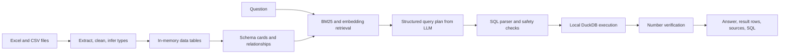

# Insight Flow: Data and AI Study Guide

This guide explains the data and AI parts of the project so you can study them later or give this document to another language model. It covers spreadsheet ingestion, data profiling, relationship detection, retrieval augmented generation (RAG), model setup and calls, SQL tool execution, answer verification, privacy, caching, evaluation, and current limitations.

It intentionally leaves out the browser interface and the web-server/API route implementation. It mentions session coordination only where it affects data, model calls, or follow-up context. No API key or `.env` value is included here.

## 1. What the system does

Insight Flow answers natural-language questions about spreadsheet workbooks. The language model interprets a question and proposes a query. The application validates and runs that query against spreadsheet data loaded into an in-memory analytical database. The answer is based on query output, with calculation and source information attached.

The central design principle is to use RAG for **finding relevant structure and values**, then use a database query for arithmetic. It does not try to add up embedded spreadsheet rows in the model.



### RAG, ETL, and tool calling in this project

- **ETL** means extract, transform, and load. Here it reads workbook sheets, finds headers, cleans and types their columns, and loads each sheet as an in-memory table.
- **RAG** means retrieval augmented generation. Here retrieval supplies relevant sheet and column descriptions, relationships, categories, and candidate entity values to the model prompt. The project does not embed every spreadsheet row for arithmetic.
- **Tool calling** is application-controlled in this implementation. The model returns a structured plan containing SQL; the application validates the SQL and invokes its local query executor. This is a plan-and-execute workflow, not a native Gemini function declaration.
- **LLM API** calls are used for planning, follow-up rewriting, answer phrasing, and embeddings. The query engine performs calculations locally.

## 2. Repository map for the data and AI pipeline

| File | Responsibility |
| --- | --- |
| `app/ingest.py` | Reads supported files, detects headers, normalizes names, infers types, tracks formula-cache warnings, and creates `Table` objects. |
| `app/schema.py` | Builds prompt-ready schema cards, computes a data/schema hash, and generates example question text. |
| `app/relationships.py` | Infers likely foreign-key links by column name, uniqueness, and value overlap. |
| `app/retrieve.py` | Uses BM25 and embeddings to select schema cards and high-cardinality name/value candidates. |
| `app/llm.py` | Loads the local environment, configures the official Gemini SDK, makes and retries remote calls, validates structured model output, and counts calls/tokens. |
| `app/planner.py` | Orchestrates follow-up rewriting, retrieval, prompt construction, SQL planning/repair, execution, citations, and answer composition. |
| `app/sqlguard.py` | Parses SQL and validates statement type, tables, columns, functions, row limits, and join keys before execution. |
| `app/executor.py` | Registers data frames in in-memory DuckDB and runs bounded read-only queries. |
| `app/answer.py` | Composes or templates the answer, checks numbers and dates against result cells, and chooses chart metadata. |
| `app/cache.py` | Provides a bounded in-memory LRU response cache. |
| `app/main.py` | Starts source ingestion, initializes the shared model boundary, and coordinates per-session tables, query engines, histories, and caches. Web routes are outside this guide. |
| `docs/API_CONTRACT.md` | Describes the model output contract and the internal request/response shapes shared by the implementation. |
| `docs/AGENT_CONFIG.md` | Records model defaults and SDK call examples. |
| `tests/` | Contains ingestion, relationship, SQL safety, privacy, answer-verifier, evaluation, and source-data checks. |

## 3. ETL: from workbook to usable table

The main entry points are `ingest_file(path)` and `ingest_directory(folder)` in `app/ingest.py`.

### Extract

Supported input extensions are `.xlsx`, `.xlsm`, `.xls`, and `.csv`.

- Excel Open XML files are loaded twice: once with `data_only=True` to read saved formula results, and once with `data_only=False` to identify formula cells.
- `.xls` and CSV data use pandas readers. CSV initially uses UTF-8 with BOM support and falls back to Latin-1 when decoding fails.
- Every nonempty worksheet becomes a separate `Table` object.
- Source files are read only. The ingestion code does not save changes into the uploaded workbooks.

### Transform

1. **Find a header row.** `_header(rows)` considers the first 30 rows. It scores rows based on how many cells are populated, how many are text, and how unique the labels are. The highest-scoring row becomes the header.
2. **Handle merged cells.** For a merged range, the value from its top-left cell is copied into every position in that range in the in-memory values matrix.
3. **Drop empty columns and rows.** A column is kept if it has a header or any value below the header. A data row is kept if at least one retained column has a value.
4. **Keep display names, create safe identifiers.** `safe_identifier()` lowercases and replaces non-alphanumeric runs with underscores. Identifiers starting with a digit receive a `t_` prefix. Duplicate normalized names receive unique suffixes.
5. **Infer types.** `_infer()` distinguishes booleans, dates, numbers, currency, percentages, and text. Number formats and column names help distinguish currency/percent. Names ending in `id`, and columns like `SKU`, `phone`, postal code, and ZIP, are kept as text so leading zeros and identifiers are not treated as quantities.
6. **Flag uncached formulas.** If the formula workbook has a formula but the data-only workbook has no saved result, the column metadata records the count and the table gets a warning. The app does not calculate Excel formulas itself; Excel or another spreadsheet engine must save cached results.

The internal table name is `<safe_file_stem>__<safe_sheet_name>`. The original filename, sheet label, and original column labels remain available as metadata for display and citations.

### Table and column metadata

Each `Table` carries its name, friendly alias, filename, sheet name, pandas frame, columns, warnings, and header row. Each column records:

- safe SQL name and original display name;
- inferred type and null percentage;
- distinct count, minimum/maximum where applicable;
- up to five sample values;
- all distinct values only for low-cardinality text/boolean fields (at most 50 values);
- formula-cache warning and count when relevant.

`clean_value()` converts pandas/NumPy values into ordinary JSON-safe values, dates into ISO strings, and non-finite numbers into `null`.

### Workbook snapshots and evaluation data

Workbook files are local runtime inputs and are intentionally excluded from Git. The workspace currently loads six worksheets and reports 1,680 rows total. The exact files can change without a code release, so inspect the app's workbook list when you need current per-table counts.

The source profile and golden expected results in `tests/fixtures/profile.md` and `tests/golden/` were prepared against an earlier six-file jewelry-store snapshot with 201 rows. A larger Egyptian-name demo dataset was also generated under the ignored `outputs/` directory. Those files are not bundled with the repository; don't assume the saved golden values describe whatever workbooks a user loads today.

Sales rows are line items, and invoice numbers can repeat. Count unique invoices with `COUNT(DISTINCT InvoiceNo)` rather than counting sales rows when the question asks for invoice count.

## 4. Relationship detection

`detect_relationships(tables)` searches for likely key columns across pairs of tables.

1. Normalize column labels by lowercasing and removing punctuation.
2. Map `SoldBy` and `ApprovedBy` to the semantic key `EmployeeID`.
3. Consider ID/code names, `SKU`, and similar key-like columns.
4. Compare distinct values in the two columns. At least one side must be unique. If both are unique, use the file/table name to orient the likely entity relationship.
5. Require at least 95% child-to-parent value coverage.
6. Reject many-to-many transaction-to-transaction matches.

Each detected relationship stores child table/column, parent table/column, overlap, confidence, and `many-to-one` kind. The relationship list is used twice: it becomes join guidance in the model prompt, and SQL validation requires the generated join to use an approved key equality.

Expected links for the original jewelry data are:

- Sales.CustomerID → Customers.CustomerID
- Sales.SKU → Products.SKU
- Sales.SoldBy → Employees.EmployeeID
- Purchases.SupplierID → Suppliers.SupplierID
- Purchases.SKU → Products.SKU
- Purchases.ApprovedBy → Employees.EmployeeID
- Products.SupplierID → Suppliers.SupplierID

Employees.ManagerID is a self-reference. The relationship detector currently compares pairs of distinct tables, so it does not report that self-link.

## 5. RAG and retrieval

RAG here grounds question planning in **schema and selected entity values**.

### Schema cards

`schema_cards()` turns each table into a compact card containing table name, file, sheet, row count, and columns. With ordinary privacy settings it can add up to five samples and up to 50 exact values for low-cardinality columns. String values sent in cards are limited to 60 characters.

The source has 68 columns across its six sheets, so it is above the approximately 60-column threshold used by the retriever. The larger staged workbook set keeps the same schemas, so it also crosses that threshold.

### BM25 plus embeddings

When there are at least 60 columns, `Retriever.select()`:

1. Creates one lexical document per table from the table name and original column labels.
2. Scores question/document matches with a small BM25 implementation in `bm25()`.
3. Embeds those table documents and the question using the configured embedding model.
4. Adds normalized BM25 relevance to cosine similarity and chooses up to five top-ranked table cards.
5. Adds tables connected by detected relationships so a relevant fact can still be joined safely.

The `card_cache` keeps table-document embeddings within the session so the same schema does not need to be re-embedded for every question.

### High-cardinality values

For relevant text fields with over 50 distinct values and a label matching `name`, `description`, `product`, or `customer`, retrieval builds a list of up to 1,000 distinct candidates per column. It embeds candidates in batches of 100, compares them to the question embedding, and returns up to five matches with cosine similarity over 0.35. This helps resolve fuzzy references such as a product description or a customer name to an exact stored value.

These are **entity-resolution hints**, not numeric evidence. The model must still query source tables for totals and counts.

### BM25 and cosine similarity, briefly

- **BM25** scores how much query words match a document, weighting rare terms more than common terms and normalizing for document length.
- **Embedding similarity** compares vector direction, usually using cosine similarity. It can find semantically related phrases even when the words do not exactly match.
- Combining both helps with exact column names and fuzzy business language.

## 6. LLM setup and call shapes

The model boundary is implemented in `app/llm.py` using the official `google-genai` SDK.

### Configuration

`Gemini.__init__()` calls `load_dotenv()` and reads the secret only from `GEMINI_API_KEY` in the process environment. The credential is never added to prompts or browser responses. Other environment variables choose the model IDs:

| Purpose | Environment variable | Current code default |
| --- | --- | --- |
| SQL plan / main reasoning | `GEMINI_MODEL` | `gemini-3.5-flash` |
| Follow-up rewriting / answer wording | `GEMINI_FAST_MODEL` | `gemini-3.1-flash-lite` |
| Embeddings | `GEMINI_EMBED_MODEL` | `gemini-embedding-001` |
| Per-session request cap | `MAX_CALLS_PER_SESSION` | `200` in `app/main.py` |

The SDK boundary pins outbound requests to HTTPS on `generativelanguage.googleapis.com`, disables redirects and environment proxy use, and sets SDK-level retry attempts to one. The application owns its retry loop. In the current `app/llm.py`, `HttpOptions.timeout` is `90000` milliseconds (90 seconds). This is an HTTP request timeout, not a quota setting. The `Usage` dataclass has an internal default of 40 calls, but normal application sessions override it from `MAX_CALLS_PER_SESSION`, defaulting to 200. Startup model checks use a separate small budget of eight calls.

The code rejects model IDs containing `gemini-2.5`. If the selected main or fast model is absent from the API model inventory, `startup_ai_check()` selects a compatible listed Flash/Flash Lite model. It does not silently substitute an embedding model. Successful startup inventory and a tiny `OK` generation are written to `data/runtime_models.json`.

### Structured SQL planning call

The SDK call uses `models.generate_content()` with temperature 0, JSON MIME type, and `response_json_schema=PLAN_SCHEMA`. The required object fields are:

```json
{
  "needs_clarification": null,
  "sql": "SELECT ... LIMIT 1000",
  "tables_used": ["sales__sales"],
  "columns_used": ["sales__sales.linetotalusd"],
  "assumptions": [],
  "answerable": true,
  "reason_if_unanswerable": ""
}
```

The application parses the returned JSON and checks its fields and types again. Structured output reduces malformed plans, but it does **not** make SQL safe by itself; `validate_sql()` remains mandatory.

### Embedding call

`models.embed_content()` receives a list of texts with `EmbedContentConfig(output_dimensionality=768)`. The call returns vectors used by `cosine()` in `app/retrieve.py`. Texts are table/schema descriptions, the question, or selected distinct values, depending on privacy settings.

### Fast-model calls

- Follow-up rewrite: only when there is history and a simple follow-up heuristic flags the question. The fast model rewrites the follow-up as a standalone question and does not answer it.
- Answer wording: after query execution, a separate fast call may phrase a result in one or two sentences. It receives no more than 50 rows, with string cells truncated to 60 characters.
- If `dont_send_result_rows` is enabled, the wording call is skipped and a local deterministic template is used.

### Retry and 429 behavior

Each network attempt increments the session call counter. `_call()` allows four attempts for 429 and 5xx, with exponential waits plus random jitter. Final HTTP 429 maps to `quota_exhausted` and produces the user-facing “service is busy” message. This status can mean request-per-minute, token-per-minute, daily, or other project/model limits; the app does not currently expose Google's detailed 429 reason.

Important: Google applies Gemini API rate limits per project, not per API key. A new key inside the same AI Studio project shares its quota. Check the active project's usage and model limits in Google AI Studio. A local per-session request-cap error is different from a provider 429.

The app reports safe generic errors and avoids displaying raw SDK exceptions, which could include request details. This protects sensitive information but loses useful quota subreason diagnostics.

### Model-record consistency note

The repository currently has inconsistent historical evidence: `data/runtime_models.json` records an available-model list and `tiny_call: passed`, while `docs/AGENT_CONFIG.md`, `STATUS.md`, and `reports/BUILD_REPORT.md` say an authenticated startup/model call was blocked or not verified. Treat the JSON as a recorded snapshot, not proof that the current key/project can call the listed models. Re-run a safe check against the current project before making a live-availability claim.

## 7. Prompt construction and prompt-injection defense

`prompt_for()` includes:

- fixed instructions for read-only spreadsheet answering;
- today's date;
- the standalone question;
- selected schema cards and detected relationships;
- generated few-shot examples using actual table/column names;
- up to three prior turns;
- resolved value candidates from retrieval.

Workbook contents are untrusted input. Samples, category values, candidate names, prior result rows, and validator errors are placed inside marked data blocks with an instruction to treat them as data, never as instructions. Model instructions say to use only listed tables/columns, quote identifiers, use explicit safe joins, avoid external/file functions, use one SELECT, cap results, ask for clarification when ambiguous, and never calculate mentally.

This is a defense layer, not a guarantee that a model ignores injection. SQL validation, least privilege, bounded payloads, deterministic execution, and injection tests provide additional layers.

## 8. Planner and tool-execution flow

`Planner.ask()` coordinates one question:

1. Check for a destructive request (`delete`, `drop`, `update`, `overwrite`, etc.). If detected, refuse before any model call.
2. Ensure data exists and construct bounded history.
3. Check the response cache.
4. Rewrite a follow-up if needed.
5. Build schema cards and retrieve relevant tables/value candidates.
6. Ask the main model for the structured plan.
7. If the model asks for clarification, return the question/options without executing SQL.
8. If the model says the data cannot answer the question, return an honest unanswerable result.
9. Validate SQL. If validation or execution fails, send sanitized feedback for repair. The code makes the initial plan plus at most two repair attempts.
10. Execute the accepted SQL in DuckDB.
11. Phrase and verify the answer, derive citations from parsed SQL, store result/history, then cache the response.

This is commonly called **tool calling** because the language model requests a tool operation, and the application decides whether and how to execute it. The “tool” is the local, restricted SQL executor.

## 9. SQL safety and local computation

`app/sqlguard.py` uses sqlglot's DuckDB parser to inspect the SQL abstract syntax tree before execution.

The main checks are:

- exactly one query statement, and it must be a SELECT/allowed set-operation query;
- no INSERT, UPDATE, DELETE, CREATE, DROP, ALTER, COPY, ATTACH, INSTALL, LOAD, PRAGMA, SET, EXPORT, or command-like nodes;
- no external file/network/system functions, plus an allowlist for anonymous functions;
- every physical table must be loaded locally, with no catalog/database prefix;
- columns must resolve against the known schema and ambiguous references are rejected;
- joins require explicit ON predicates using detected key pairs; each AND-conjoined equality must connect the new join target to an already-scoped table through an approved relationship;
- add `LIMIT 1000` when missing, cap larger limits to 1000, and reject invalid negative/nonliteral limits.

`Executor` creates `duckdb.connect(':memory:')`, registers each pandas frame as a table, disables DuckDB external access, and uses two threads. It starts a ten-second interrupt timer, fetches at most 1,001 rows to detect overflow, and returns no more than 1,000. This makes the database a calculation layer over in-memory data rather than a writer to the original files.

Citations are computed from the parsed query: loaded tables, qualified columns, and join relationships actually used. The model's `tables_used` and `columns_used` lists are not trusted as citations by themselves.

## 10. Answer composition and numeric verification

The answer layer aims to keep language and arithmetic separate:

1. DuckDB returns the numerical result.
2. Unless result sharing is disabled, the fast model sees a bounded result sample and writes short prose.
3. `verify_numbers()` extracts numeric claims, percentages, dates, common written-out numbers, and compact K/M/B/T forms from the prose.
4. Every detected claim must match a value in the result, within a rounding tolerance. If a claim fails verification or the call fails, `template_answer()` creates deterministic prose from the result.

The result table is the source of numeric truth. No model-written calculation is used. The answer card also contains SQL, source sheets/columns, join keys, assumptions, latency/token metadata, and chart metadata in the response object.

Chart selection is deterministic: it needs 2–100 rows, at least one label column and one numeric column; date-like labels choose a line chart, otherwise a small “share” result may choose a pie, and other eligible grouped results choose a bar chart.

Known limits are recorded in `docs/RELEASE_SIGNOFF.md`: number/date parsing has edge cases, behavior grading is partial, nested CTE/alias citations still need parser-backed verification, and the evaluator's aggregate call cap can overshoot within a multi-call request. Treat number verification as a guardrail, not a formal proof of every sentence.

## 11. History, privacy, and cache

### Multi-turn history

The latest three successful turns are retained with the question, validated SQL, result columns/count, and a bounded result summary. Ordinary mode may include up to five prior result rows; result values are shortened. Follow-up detection is a heuristic for words like “and”, “only”, “sort”, “those”, or “same”. A fast-model rewrite produces a standalone question before planning.

### Privacy switches

- **Schema-only mode** removes sample values, distinct/category lists, textual min/max, retrieved value matches, and prior result rows from model payloads/embedding input. Numeric/date schema aggregates can remain. The user's own question text remains because it is needed to answer.
- **Don't send result rows** skips the answer-phrasing model and uses a local template; previous result rows are also omitted from history/rewrite prompts.
- Normal answer phrasing sends at most 50 result rows and truncates string cells to 60 characters.

These switches reduce what is shared; they do not turn the model-backed question planner into a fully local system. Selected schema/value context still goes to the configured model API unless all relevant sharing is disabled by the applicable option.

### Cache

`ResponseCache` is an in-memory LRU cache with a capacity of 128 responses per session. Its key hashes the question, schema/data hash, model, privacy settings, and history. The schema/data hash combines table/column schema with each frame's JSON content. A cache hit avoids model calls and returns a copy so one response cannot mutate the stored value.

## 12. Testing and evaluation

The project includes several layers of intended evidence:

- `tests/test_ingest.py`: original workbooks, supported/error files, and a messy workbook with title/blank/merged rows, duplicate headers, mixed dates, formula-cache gaps, and an injection string.
- `tests/test_relationships.py`: expected jewelry dataset foreign keys and rejection of spurious transaction-to-transaction links.
- `tests/test_sqlguard.py`: destructive SQL, multi-statement SQL, file/network functions, unknown tables, required limits, and safe/unsafe joins.
- `tests/test_executor.py`: in-memory query behavior, caps, timeout/file isolation.
- `tests/test_schema_privacy.py` and `tests/test_privacy_payload.py`: schema-only and no-result-row prompt behavior and truncation.
- `tests/test_answer.py`: number verifier and deterministic fallback behavior.
- `tests/test_secret_scan.py`: scans files against a test marker; the scanner never prints the searched secret.
- `tests/golden/questions.json` and `tests/golden/expected_results.json`: 61 natural-language cases. Independent calculations currently cover 35 direct numeric/grouping cases plus eight follow-up expected results; the rest test clarification, unanswerable, destructive, or prompt-injection behavior.
- `tests/golden/calculate_expected.py`: computes expected values independently from app query code.
- `tests/eval_harness.py`: quota-aware mock/live modes, sequential requests, retries, cache, follow-up setup requests, and per-question SQL/result/verdict/token/latency records.

### Current verification status

`reports/BUILD_REPORT.md` says mock evaluation ran with zero model calls, but most cases were skipped because no recorded application answers existed. It reports no live accuracy, latency, token, or screenshot evidence. `pytest`, full app startup, SQL parser tests, and Playwright end-to-end checks were unavailable in the recorded environment because dependencies were missing and package-index DNS could not be resolved. Source-level controls and syntax checks are not the same as passing integration tests.

The expected-results tests assume the original 201 source rows. If the staged Egyptian data is installed, regenerate independent expectations and update row-count assertions before using the existing golden evaluation as evidence.

## 13. Operational troubleshooting notes

- **“The online answer service is busy.”** The app maps a final provider HTTP 429 to `quota_exhausted`. It retries up to four times first. A 429 may be a per-minute, per-token, daily, or spend limit. Newly created keys in the same Google AI Studio project share project quota. Check the project's model-specific limits and usage.
- **Model not found.** Check configured model IDs and the current model inventory. A public model catalog does not prove the current account/project can invoke that model.
- **Missing key.** `load_dotenv()` loads local `.env`; verify the variable name is present without printing the value. Restart the process after changes.
- **Timeout.** The current network request timeout is 90 seconds. This is separate from DuckDB's 10-second query interrupt and separate from 429 quota errors.
- **Empty or wrong schema.** Inspect `data/source/`, supported extensions, header detection, formula-cache warnings, and workbook protection/corruption.
- **Join refused.** Inspect the detected relationships. The SQL guard intentionally rejects guessing and also conservatively refuses some derived-table/CTE joins without trusted lineage.
- **Formula field is empty.** The input workbook may not have cached formula results. Open, recalculate, and save it in a spreadsheet application, then reload the data.

### Official references

- [Gemini API rate limits](https://ai.google.dev/gemini-api/docs/rate-limits): limits include requests/minute, tokens/minute, and requests/day; limits are per project rather than per API key.
- [Gemini API troubleshooting](https://ai.google.dev/gemini-api/docs/troubleshooting): retry guidance for 429 and 5xx responses.
- [Gemini structured output](https://ai.google.dev/gemini-api/docs/structured-output): JSON schema-constrained generation.
- [Google Gen AI Python SDK](https://googleapis.github.io/python-genai/): SDK client and call references.

## 14. Suggested learning order

1. Read `app/ingest.py` and trace one workbook through `_header()`, `_infer()`, `_table()`, and `ingest_file()`.
2. Inspect one resulting `Table` object: compare its safe column names, original names, inferred types, samples, distinct categories, and row count.
3. Read `app/relationships.py`; manually verify why a unique parent key and high overlap make a relationship plausible.
4. Read `app/schema.py` and `app/retrieve.py`; work through a question that uses a known column versus a fuzzy product/customer name.
5. Read `app/llm.py` and `app/planner.py`; trace the structured JSON plan and follow-up/answer calls. Practice identifying exactly what information crosses the model boundary.
6. Read `app/sqlguard.py`; try to explain why `SELECT` is not automatically safe and how AST/table/column/join checks work.
7. Read `app/executor.py`; verify that the model never computes totals and cannot read arbitrary files through the DuckDB connection.
8. Read `app/answer.py`; trace a result number from query output through verification and fallback.
9. Read the tests, `docs/API_CONTRACT.md`, and `reports/BUILD_REPORT.md`; distinguish code that exists from behavior proven by executed tests.
10. If installing the staged refreshed data, first replace the source files as one complete set, then update the independent expected calculations and tests that assume 201 rows.

## 15. Glossary

| Term | Meaning here |
| --- | --- |
| ETL | Extract workbook data, transform headers/values/types, and load each sheet into in-memory tables. |
| RAG | Retrieve relevant schema/relationship/value context before asking the model to plan. |
| Tool calling | Model requests a structured query; application validates and executes it using a controlled local tool. |
| Schema card | Compact description of a table and its columns, types, bounds, samples, and categories. |
| BM25 | Lexical text-relevance scoring method used to rank table descriptions. |
| Embedding | Vector representation used to compare semantic similarity. |
| Foreign key | A field in one table whose values point to unique keys in another table. |
| AST | Abstract syntax tree, the parsed structure SQL validation checks rather than just searching raw text. |
| Cached formula result | The last value saved by a spreadsheet engine for a formula. The app reads it; it does not recalculate it. |
| Data lineage/citation | Which source tables, fields, and approved join keys contributed to the result. |
| Schema-only | Privacy option that removes samples and value lists from model context. |
| Result-row privacy | Option that skips sending query result rows for answer phrasing and uses a local template. |
| Provider 429 | A model-service rate/quota response. It differs from the app's own per-session call cap. |
